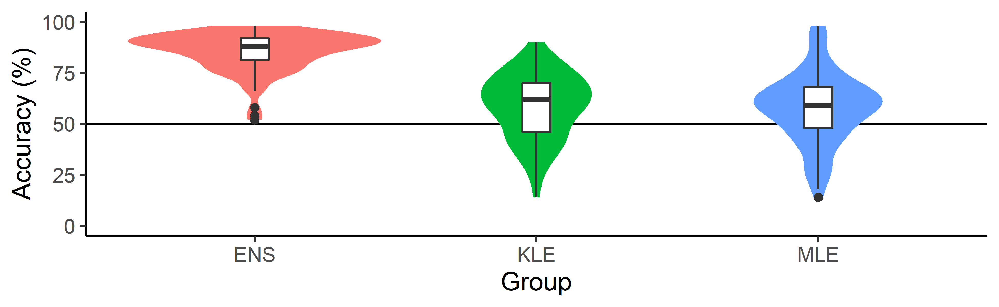
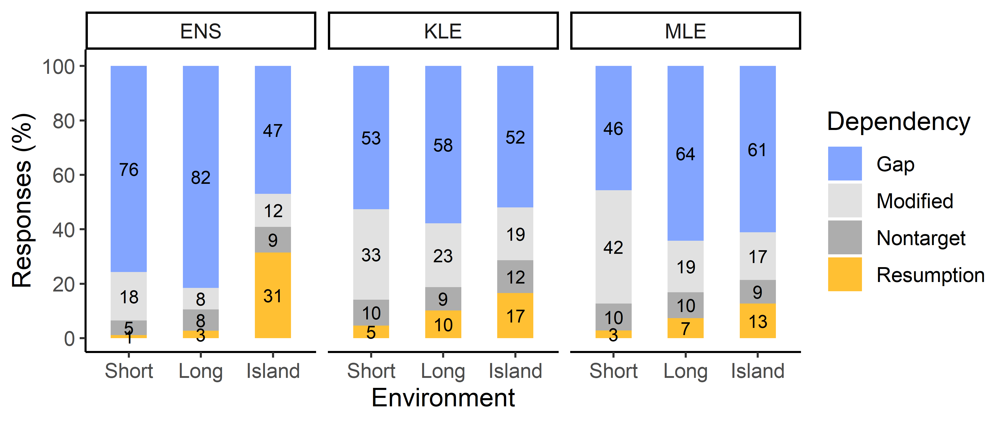
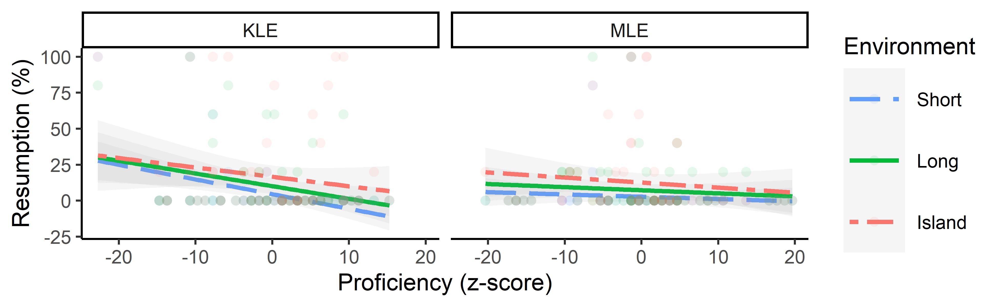
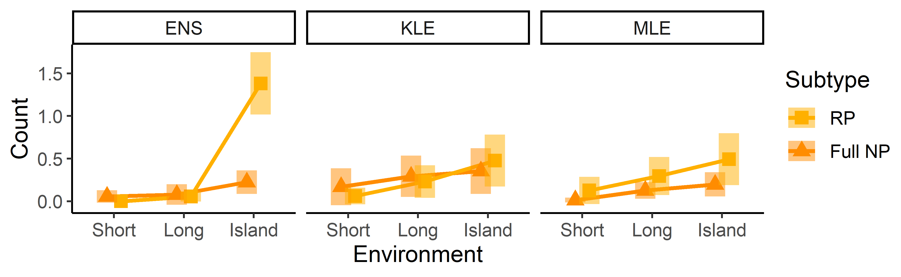
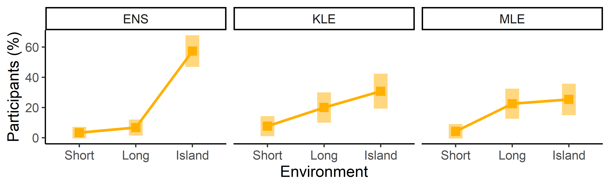
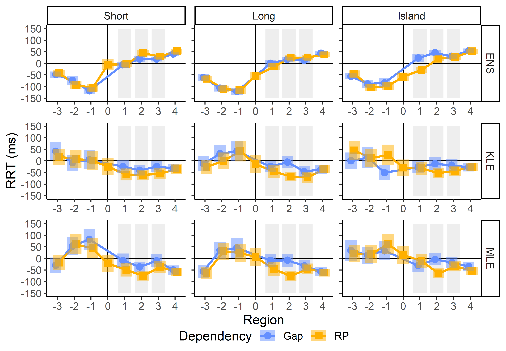
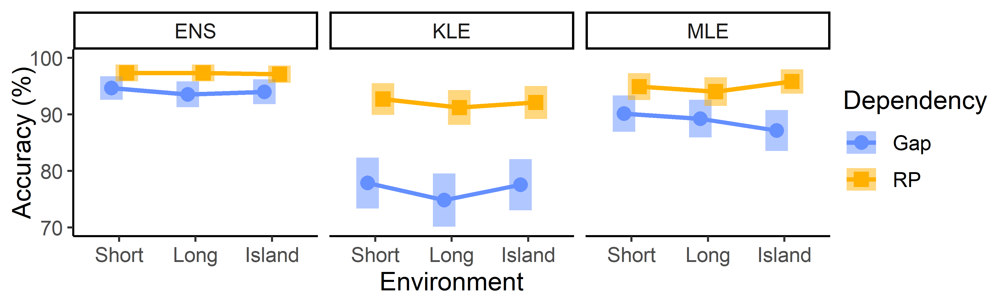

```{css echo = FALSE}

.header-section-number::after {
  content: '.';
}

```

```{r include = FALSE}

# set global options ...

knitr::opts_chunk$set(warning = FALSE, message = FALSE)

# load packages ...

library(tidyverse)
library(kableExtra)
library(emmeans)
library(ggh4x)
library(magick)

```

```{r eval = FALSE, include = FALSE}

# load main dataframe ...

df <- read_csv('data/data.csv', col_types = cols(.default = 'c')) %>%
  select(-audio_data)

# load c-test data ...

ct <- read_csv('data/ctest_scored.csv', col_types = cols(.default = 'f', accuracy = 'l'))

# prep proficiency scores ...

proficiency <- ct %>%
  group_by(study, group, participant) %>%
  summarise(proficiency = sum(accuracy, na.rm=T)) %>%
  ungroup()

# prep ept data ...

ep <- df %>%
  filter(task == 'ept') %>%
  arrange(study, group, participant) %>%
  select_if(function(x){!all(is.na(x))})

# prep sprt data ...

spr <- df %>%
  filter(task == 'sprt') %>%
  arrange(study, group, participant) %>%
  select_if(function(x){!all(is.na(x))})

# prep ajt data ...

ajt <- df %>%
  filter(task %in% c('english_ajt', 'korean_ajt', 'mandarin_ajt')) %>%
  arrange(study, group, participant) %>%
  select_if(function(x){!all(is.na(x))})

```

# (APPENDIX) Results Tables from the ORC and SRC Studies {-}

# ORC Study

## C-Test

```{r ctest-plot-setup, eval = FALSE, include = FALSE}

# summarise ...

plot <- ct %>%
  group_by(study, group, participant) %>%
  summarise(accuracy = mean(accuracy)) %>%
  ungroup()

check <- plot %>%
  group_by(study, group) %>%
  summarise(mean = mean(accuracy),
            min = min(accuracy),
            max = max(accuracy)) %>%
  ungroup()

check <- ct %>%
  group_by(study, group) %>%
  summarise(mean = mean(accuracy)) %>%
  ungroup()

# define plot data ...

p1 <- ggplot(data=filter(plot, study == '210510_do'), aes(x=group, y=accuracy*100, fill=group, label=participant))
p2 <- ggplot(data=filter(plot, study == '210510_su'), aes(x=group, y=accuracy*100, fill=group, label=participant))

# define plot styling ...

s <- list(
  geom_hline(yintercept=50),
  geom_violin(col = NA),
  geom_boxplot(width = .1, fill='white'),
  #geom_jitter(size=1, shape=1, alpha=.25, position = position_jitter(seed=2, width=.15)),
  #geom_text(size = 2.5, col = "black", position = position_jitter(seed=2)),
  theme_classic(),
  scale_x_discrete(name='Group',
                   limits = c('english', 'korean', 'mandarin'), labels = c('ENS', 'KLE', 'MLE')),
  scale_y_continuous(name="Accuracy (%)",
                     limits=c(0, 100)),
  theme(text = element_text(size = 12),
        plot.title = element_text(size = 12, hjust = .5),
        legend.position = "hide")
)

# print and save ...

p1 + s
ggsave('plots/orc/ctest.png', width=6.5, height=2, dpi=600)

p2 + s
ggsave('plots/src/ctest.png', width=6.5, height=2, dpi=600)

```

```{r ctest-figure, echo = FALSE, out.width = '624px', fig.cap = 'Accuracy rates on the English C-test. Center lines mark median values; boxes represent interquartile ranges; whiskers extend to the furthest data points within 1.5 times the interquartile range from the box; points are outliers.'}



```

## Elicited Production Task

### Descriptive Statistics

```{r ept-rate-descriptive, echo = FALSE, out.width = '624px', fig.cap = 'Response rate by type.'}



```

### Resumption Rates

```{r ept-rate-primary, echo = FALSE}

model <- read_rds('models/ajt_doall_glmer_md5.rds')

table <- summary(model)$coefficients %>%
  as.data.frame() %>%
  rownames_to_column('Parameter') %>%
  rename('*SE*' = 'Std. Error', '*z*' = 'z value', '*p*' = 'Pr(>|z|)') %>%
  mutate_if(is.character, str_replace_all,
            c('environment2' = 'Environment(Long)', 'environment3' = 'Environment(Island)',
              'group2' = 'Group(KLE)', 'group3' = 'Group(MLE)'))

table %>%
  kable(caption = 'Summary of Logistic Regression Model on Resumption Rates',
        digits = c(2, 2, 2, 2, 3)
        ) %>%
  kable_classic(bootstrap_options = c('condensed')) %>%
  footnote(general = 'Model formula: Resumption ~ Environment * Group + (1 + Environment | Participant) + (1 | Item). Reference level: Short + ENS. Estimate unit: logit. Intercept: grand mean.',
           footnote_as_chunk = TRUE)

```

```{r ept-rate-posthoc, echo = FALSE}

pairs <- pairs(emmeans(model, ~ environment * group), adjust = 'mvt', simple = 'each', combine = TRUE, reverse = TRUE)

table <- pairs %>%
  as.data.frame() %>%
  rename('*p*' = 'p.value', '*z*' = 'z.ratio', '*SE*' = 'SE',
         'Environment' = 'environment', 'Group' = 'group', 
         'Contrast' = 'contrast', 'Estimate' = 'estimate') %>%
  mutate_if(is.character, str_replace_all, 
            c('english' = 'ENS', 'korean' = 'KLE', 'mandarin' = 'MLE',
              'short' = 'Short', 'long' = 'Long', 'island' = 'Island')) %>% 
  select(-df)

table %>%
  kable(caption = 'Pairwise Comparisons for Logistic Regression Model on Resumption Rates',
        digits = c(2, 2, 2, 2, 2, 2, 3)
        ) %>%
  kable_classic(bootstrap_options = c('condensed')) %>%
  footnote(general = '*P*-value adjustment: multivariate *t* method for 18 tests.',
           footnote_as_chunk = TRUE)

```

```{r ept-rate-figure, echo = FALSE, fig.with = 6.5, fig.height = 2, fig.cap = 'Estimated marginal means from logistic regression model on resumption rates. Transparent bars are 95% confidence intervals; solid bars are comparison bars from post-hoc tests.'}

plot <- plot(emmeans(model, ~ environment * group), adjust = 'mvt', by = 'group', combine = TRUE, reverse = TRUE, comparisons = TRUE, plotit = FALSE)

ggplot(plot, aes(x = environment, y = the.emmean, group = group)) +
  geom_errorbar(aes(ymin = asymp.LCL, ymax = asymp.UCL), width = 0, lwd = 5, col = '#ffb000', alpha = .5, position = position_dodge(width = .4)) +
  geom_errorbar(aes(ymin = case_when(is.na(lcmpl)~the.emmean, TRUE ~ lcmpl), ymax = case_when(is.na(rcmpl)~the.emmean, TRUE ~ rcmpl)), width = 0, lwd = 1, col = '#ffb000', position = position_dodge(width = .4)) +
  geom_line(lwd = 1, col = '#ffb000', position = position_dodge(width = .4)) +
  geom_point(size = 3, col = '#ffb000', shape = 15, position = position_dodge(width = .4)) +
  theme_classic() +
  scale_y_continuous(name='Resumption (logits)', limits = c(-20, 0)) +
  scale_x_discrete(name='Environment', labels = c('Short', 'Long', 'Island')) +
  theme(text = element_text(size = 12), 
        legend.margin=margin(0, 0, 0, -5)) +
  facet_wrap(~group, labeller = as_labeller(c(`english` = 'ENS', `korean` = 'KLE', `mandarin` = 'MLE')))

# ggsave("plots/orc/ept_rate_emmeans.png", width=6.5, height=2, dpi=600)

```

### Proficiency Effects

```{r ept-proficiency-descriptive, echo = FALSE, out.width = '624px', fig.cap = 'Relationship between resumption rates and proficiency scores. Shaded regions are 95% confidence intervals as predicted by the linear models used to generate the trend lines.'}



```

```{r ept-proficiency-primary, echo = FALSE}

model <- read_rds('models/ept_orc_glmer_md2.rds')

table <- summary(model)$coefficients %>%
  as.data.frame() %>%
  rownames_to_column('Parameter') %>%
  rename('*SE*' = 'Std. Error', '*z*' = 'z value', '*p*' = 'Pr(>|z|)') %>%
  mutate_if(is.character, str_replace_all,
            c('environment2' = 'Environment(Long)', 'environment3' = 'Environment(Island)',
              'group2' = 'Group(MLE)',
              'proficiency' = 'Proficiency'))

table %>%
  kable(caption = 'Summary of Logistic Regression Model for Proficiency Effects on Resumption Rates',
        digits = c(2, 2, 2, 2, 3)
        ) %>%
  kable_classic(bootstrap_options = c('condensed')) %>%
  footnote(general = 'Model formula: Resumption ~ Environment * Group + (1 + Environment | Participant) + (1 | Item). Reference level: Short + KLE. Estimate unit: logit. Intercept: grand mean.',
           footnote_as_chunk = TRUE)

```

```{r ept-proficiency-posthoc, echo = FALSE}

trends <- emtrends(model, ~ environment * group, var = 'proficiency', adjust = 'mvt')
test <- test(trends)

table <- test %>%
  as.data.frame() %>%
  rename('Group' = 'group', 'Environment' = 'environment', 'Estimate' = 'proficiency.trend', '*z*' = 'z.ratio', '*p*' = 'p.value', '*SE*' = 'SE') %>%
  mutate(Group = recode(Group, korean = 'KLE', mandarin = 'MLE'),
         Environment = recode(Environment, short = 'Short', long = 'Long', island = 'Island')) %>%
  select(-df)

table %>%
  kable(caption = 'Post-Hoc Tests from Logistic Regression Model for Proficiency Effects on Resumption Rates',
        digits = c(2, 2, 2, 2, 2, 3)
        ) %>%
  kable_classic(bootstrap_options = c('condensed')) %>%
  footnote(general = '*P*-value adjustment: multivariate *t* method for 6 tests.',
           footnote_as_chunk = TRUE)

```

```{r ept-proficiency-figure, echo = FALSE, fig.with = 6.5, fig.height = 2, fig.cap = 'Relationship between resumption rates and proficiency scores from post-hoc tests. Transparent bars are 95% confidence intervals; solid bars are comparison bars from post-hoc tests.'}

plot <- emmip(model, environment ~ proficiency | group, cov.reduce = range, CIs = TRUE, plotit = FALSE)

ggplot(plot, aes(x = xvar, y = yvar, group = environment, col = environment, linetype = environment)) +
  theme_classic() +
  geom_ribbon(aes(ymin = LCL, ymax = UCL, fill = environment), alpha = .1, col = NA) +
  geom_line(lwd = .75) +
  scale_y_continuous(name='Resumption (logits)') +
  scale_x_continuous(name='Proficiency (z-score)') +
  scale_linetype_manual(name = 'Environment', 
                        values = c('longdash', 'solid', 'twodash'), 
                        labels = c('Short', 'Long', 'Island')) +
  scale_color_manual(name = 'Environment', 
                     values = c('#619CFF', '#00BA38', '#F8766D'), 
                     labels = c('Short', 'Long', 'Island')) +
  scale_fill_manual(name = 'Environment', 
                    values = c('#619CFF', '#00BA38', '#F8766D'), 
                    labels = c('Short', 'Long', 'Island')) +
  theme(legend.key.size = unit(2,"line")) +
  facet_wrap(~group, labeller = as_labeller(c(`korean` = 'KLE', `mandarin` = 'MLE')))

# ggsave("plots/orc/ept_resumption_proficiency_emmeans.png", width=6.5, height=2, dpi=600)

```

### Resumption Subtypes

```{r ept-subtype-descriptive, echo = FALSE, out.width = '624px', fig.cap = 'Mean counts for resumption subtypes. Error bars are 95% confidence intervals. Because participants completed five trials per condition, the mean tokens per condition could not exceed five.'}



```

```{r ept-subtype-primary, echo = FALSE}

model <- read_rds('models/ept_orc_resumption_type_glmmtmb_model2.rds')

md <- read_rds('models/ept_orc_resumptoin_type_glmmtmb_data.rds')

table <- summary(model)$coefficients$cond %>%
  as.data.frame() %>%
  rownames_to_column('Parameter') %>%
  rename('*SE*' = 'Std. Error', 'z' = 'z value', 'p' = 'Pr(>|z|)') %>%
  mutate_if(is.character, str_replace_all, 
            c('subtype2' = 'Subtype(Full NP)',
              'environment2' = 'Environment(Long)', 'environment3' = 'Environment(Island)',
              'group2' = 'Group(KLE)', 'group3' = 'Group(MLE)')) %>%
  rename('*p*' = 'p', '*z*' = 'z')

table %>%
  kable(caption = 'Summary of Negative Binomial Regression Model on Resumption Subtypes', 
        escape = FALSE,
        digits = c(2, 2, 2, 2, 3)) %>% 
  kable_classic(bootstrap_options = c('condensed')) %>%
  footnote(general = 'Model formula: Count ~ Subtype * Environment * Group + (1 + Environment | Participant). Reference level: Pronoun + Long + ENS. Estimate unit: log count. Intercept: grand mean.',
           footnote_as_chunk = TRUE)

```

```{r ept-subtype-posthoc, echo = FALSE}

pairs <- pairs(emmeans(model, ~ subtype * environment * group), adjust = 'mvt', simple = 'each', combine = TRUE, reverse = TRUE)

table <- pairs %>%
  as.data.frame() %>%
  rename('*p*' = 'p.value', '*t*' = 't.ratio', '*SE*' = 'SE',
         'Environment' = 'environment', 'Group' = 'group', 'Subtype' = 'subtype', 
         'Contrast' = 'contrast', 'Estimate' = 'estimate') %>%
  mutate_if(is.character, str_replace_all, 
            c('english' = 'ENS', 'korean' = 'KLE', 'mandarin' = 'MLE',
              'short' = 'Short', 'long' = 'Long', 'island' = 'Island', 
              'pronoun' = 'Pronoun', 'fullNP' = 'Full NP'))

table %>%
  kable(caption = 'Pairwise Comparisons for Binomial Regression Model on Resumption Subtypes',
      digits = c(2, 2, 2, 2, 2, 2, 2, 2, 3)) %>% 
  kable_classic(bootstrap_options = c('condensed')) %>%
  remove_column(7) %>%
  footnote(general = '*P*-value adjustment: multivariate *t* method for 24 tests.',
           footnote_as_chunk = TRUE)

```

```{r ept-subtype-figure, echo = FALSE, fig.with = 6.5, fig.height = 2, fig.cap = 'Estimated marginal means from negative binomial regression model on resumption subtypes. Transparent bars are 95% confidence intervals; solid bars are comparison bars from post-hoc tests.'}

plot <- plot(emmeans(model, ~ subtype * environment * group), combine = TRUE, comparisons = TRUE, adjust = 'mvt', plotit = FALSE)

ggplot(plot, aes(x = environment, y = the.emmean, group = subtype, col = subtype, shape = subtype)) +
  geom_errorbar(aes(ymin = lower.CL, ymax = upper.CL), width = 0, lwd = 5, alpha = .5, position = position_dodge(width = .4)) +
  geom_errorbar(aes(ymin = case_when(is.na(lcmpl)~the.emmean, TRUE ~ lcmpl), ymax = case_when(is.na(rcmpl)~the.emmean, TRUE ~ rcmpl)), width = 0, lwd = 1, position = position_dodge(width = .4)) +
  geom_line(lwd = 1, position = position_dodge(width = .4)) +
  geom_point(size = 3, position = position_dodge(width = .4)) +
  theme_classic() +
  scale_y_continuous(name='Count (log)') +
  scale_x_discrete(name='Environment', labels = c('Long', 'Island')) +
  scale_colour_manual(name='Subtype', 
                      values=c('#ffb000', 'darkorange'),
                      breaks = c('pronoun', 'fullNP'),
                      labels = c('RP', 'Full NP')) +
  scale_shape_manual(name='Subtype', 
                     values=c(15, 17),
                     breaks = c('pronoun', 'fullNP'),
                     labels = c('RP', 'Full NP')) +
  theme(text = element_text(size = 12), 
        legend.margin=margin(0, 0, 0, -5)) +
  facet_wrap(~group, labeller = as_labeller(c(`english` = 'ENS', `korean` = 'KLE', `mandarin` = 'MLE')))

# ggsave("plots/orc/ept_resumption_type_count_emmeans.png", width=6.5, height=2, dpi=600)

```

### Resumption Use

```{r ept-use-descriptive, echo = FALSE, out.width = '624px', fig.cap = 'Proportion of participants who used resumption. Error bars are 95% confidence intervals.'}



```

```{r ept-use-primary, echo = FALSE}

model <- read_rds('models/ept_coverage_glmer_model1.rds')

table <- summary(model)$coefficients %>%
  as.data.frame() %>%
  rownames_to_column('Parameter') %>%
  rename('*SE*' = 'Std. Error', '*z*' = 'z value', '*p*' = 'Pr(>|z|)') %>%
  mutate_if(is.character, str_replace_all, 
            c('environment2' = 'Environment(Long)', 'environment3' = 'Environment(Island)',
              'group2' = 'Group(KLE)', 'group3' = 'Group(MLE)'))

# check <- table %>% 
#   mutate(OR = round(exp(abs(Estimate)), 2))

table %>%
  kable(caption = 'Summary of Logistic Regression Model on Resumption Use',
        digits = c(2, 2, 2, 2, 3)
        ) %>%
  kable_classic(bootstrap_options = c('condensed')) %>%
  footnote(general = 'Model formula: Use ~ Environment * Group + (1 | Participant). Reference level: Short + ENS. Estimate unit: logit. Intercept: grand mean.',
           footnote_as_chunk = TRUE)

```

```{r ept-use-posthoc, echo = FALSE}

pairs <- pairs(emmeans(model, ~ environment * group), adjust = 'mvt', simple = 'each', combine = TRUE, reverse = TRUE)

# eff_size(pairs, sigma = sigma(model), edf = df.residual(model), method = 'identity')

table <- pairs %>%
  as.data.frame() %>%
  rename('*p*' = 'p.value', '*z*' = 'z.ratio', '*SE*' = 'SE',
         'Environment' = 'environment', 'Group' = 'group',
         'Contrast' = 'contrast', 'Estimate' = 'estimate') %>%
  mutate_if(is.character, str_replace_all, 
            c('english' = 'ENS', 'korean' = 'KLE', 'mandarin' = 'MLE',
              'short' = 'Short', 'long' = 'Long', 'island' = 'Island')) %>%
  select(-df)

# check <- table %>%
#   mutate(OR = round(exp(abs(Estimate)), 2))

table %>%
  kable(caption = 'Pairwise Comparisons for Logistic Regression Model on Resumption Use',
        digits = c(2, 2, 2, 2, 2, 2, 3)
        ) %>%
  kable_classic(bootstrap_options = c('condensed')) %>%
  footnote(general = '*P*-value adjustment: multivariate *t* method for 18 tests.',
           footnote_as_chunk = TRUE)

```

```{r ept-use-figure, echo = FALSE, fig.with = 6.5, fig.height = 2, fig.cap = 'Estimated marginal means from logistic regression model on resumption use. Transparent bars are 95% confidence intervals; solid bars are comparison bars from post-hoc tests.'}

plot <- plot(emmeans(model, ~ environment | group), combine = TRUE, comparisons = TRUE, adjust = 'mvt', plotit = FALSE)

ggplot(plot, aes(x = environment, y = the.emmean, group = group)) +
  geom_errorbar(aes(ymin = asymp.LCL, ymax = asymp.UCL), width = 0, lwd = 5, col = '#ffb000', alpha = .5, position = position_dodge(width = .4)) +
  geom_errorbar(aes(ymin = case_when(is.na(lcmpl)~the.emmean, TRUE ~ lcmpl), ymax = case_when(is.na(rcmpl)~the.emmean, TRUE ~ rcmpl)), width = 0, lwd = 1, col = '#ffb000', position = position_dodge(width = .4)) +
  geom_line(lwd = 1, col = '#ffb000', position = position_dodge(width = .4)) +
  geom_point(size = 3, col = '#ffb000', shape = 15, position = position_dodge(width = .4)) +
  theme_classic() +
  scale_y_continuous(name='Usage Rate (logits)') +
  scale_x_discrete(name='Environment', labels = c('Short', 'Long', 'Island')) +
  theme(text = element_text(size = 12), 
        legend.margin=margin(0, 0, 0, -5)) +
  facet_wrap(~group, labeller = as_labeller(c(`english` = 'ENS', `korean` = 'KLE', `mandarin` = 'MLE')))

# ggsave("plots/orc/ept_coverage_emmeans.png", width=6.5, height=2, dpi=600)

```

## Self-Paced Reading Task

### Descriptive Statistics

```{r spr-rrt-descriptive, echo = FALSE, out.width = '624px', fig.cap = 'Mean Residual Reading Times by Region. Error bars are 95% confidence intervals.'}



```

### RRTs at Region 1

```{r spr-rrt-region1-primary, echo = FALSE}

# data <- read_rds('data/spr_rrt_md.rds')

model <- read_rds('models/spr_doall_rrt_region1_md6.rds')

table <- summary(model)$coefficients %>%
  as.data.frame() %>%
  rownames_to_column('Parameter') %>%
  rename('*SE*' = 'Std. Error', '*t*' = 't value', '*p*' = 'Pr(>|t|)') %>%
  mutate_if(is.character, str_replace_all,
            c('dependency2' = 'Dependency(RP)', 
              'environment2' = 'Environment(Long)', 'environment3' = 'Environment(Island)',
              'group2' = 'Group(KLE)', 'group3' = 'Group(MLE)')) %>%
  select(-df)

# model %>% emmeans(~ dependency) %>%
#   eff_size(sigma = sigma(model), df.residual(model))
# 
# model %>% emmeans(~ environment) %>%
#   eff_size(sigma = sigma(model), df.residual(model))
# 
# model %>% emmeans(~ group) %>%
#   eff_size(sigma = sigma(model), df.residual(model))

table %>%
  kable(caption = 'Summary of Linear Regression Model on RRTs at Region 1',
        digits = c(2, 2, 2, 2, 3)
        ) %>%
  kable_classic(bootstrap_options = c('condensed')) %>%
  footnote(general = 'Model formula: RRT ~ Dependency * Environment * Group + (1 + Dependency | Participant) + (1 + Dependency + Group | Item). Reference level: Gap + Short + ENS. Estimate unit: millisecond. Intercept: grand mean.',
           footnote_as_chunk = TRUE)

```

```{r spr-rrt-region1-emmeans, eval = FALSE, echo = FALSE}

emmeans <- emmeans(model, ~ dependency * environment * group)

emmeans %>% write_rds('models/spr_doall_rrt_region1_md6_emmeans.rds')

```

```{r spr-rrt-region1-posthoc, echo = FALSE}

emmeans <- read_rds('models/spr_doall_rrt_region1_md6_emmeans.rds')

pairs <- pairs(emmeans, 
               adjust = 'mvt', 
               simple = list('dependency', 'environment'), 
               combine = TRUE, 
               reverse = TRUE)

# check <- as.data.frame(eff_size(pairs, sigma = sigma(model), edf = df.residual(model), method = 'identity'))

table <- pairs %>%
  as.data.frame() %>%
  rename('*p*' = 'p.value', '*z*' = 'z.ratio', '*SE*' = 'SE',
         'Dependency' = 'dependency', 'Environment' = 'environment', 'Group' = 'group',
         'Contrast' = 'contrast', 'Estimate' = 'estimate') %>%
  mutate_if(is.character, str_replace_all, 
            c('english' = 'ENS', 'korean' = 'KLE', 'mandarin' = 'MLE',
              'gap' = 'Gap', 'pronoun' = 'RP',
              'short' = 'Short', 'long' = 'Long', 'island' = 'Island')) %>%
  select(-df)

table %>%
  kable(caption = 'Pairwise Comparisons for Linear Regression Model on RRTs at Region 1',
        digits = c(2, 2, 2, 2, 2, 2, 2, 3)
        ) %>%
  kable_classic(bootstrap_options = c('condensed')) %>%
  footnote(general = '*P*-value adjustment: multivariate *t* method for 27 tests.',
           footnote_as_chunk = TRUE)

```

```{r spr-rrt-region1-figure, echo = FALSE, fig.with = 6.5, fig.height = 2, fig.cap = 'Estimated marginal means from linear regression model on RRTs at Region 1. Transparent bars are 95% confidence intervals; solid bars are comparison bars from post-hoc tests.'}

plot <- plot(emmeans, comparisons = TRUE, adjust = 'mvt', plotit = FALSE)

ggplot(plot, aes(x = environment, y = the.emmean, group = dependency, col = dependency, shape = dependency)) +
  geom_hline(yintercept = 0) +
  geom_errorbar(aes(ymin = asymp.LCL, ymax = asymp.UCL), width = 0, lwd = 5, alpha = .5, position = position_dodge(width = .4)) +
  geom_errorbar(aes(ymin = case_when(is.na(lcmpl)~the.emmean, TRUE ~ lcmpl), ymax = case_when(is.na(rcmpl)~the.emmean, TRUE ~ rcmpl)), width = 0, lwd = 1, position = position_dodge(width = .4)) +
  geom_line(lwd = 1, position = position_dodge(width = .4)) +
  geom_point(size = 3, position = position_dodge(width = .4)) +
  theme_classic() +
  scale_y_continuous(name="RRT (ms)", breaks = seq(-100, 75, by = 25), limits = c(-110, 85)) +
  scale_x_discrete(name='Environment', labels = c('Short', 'Long', 'Island')) +
  scale_colour_manual(name='Dependency', values=c('#648fff', '#ffb000'), labels=c('Gap', 'RP')) +
  scale_shape_manual(name='Dependency', values=c(16, 15), labels=c('Gap', 'RP')) +
  theme(text = element_text(size = 12), 
        legend.margin=margin(0, 0, 0, -5)) +
  facet_wrap(~group, labeller = as_labeller(c(`english` = 'ENS', `korean` = 'KLE', `mandarin` = 'MLE')))

# ggsave("plots/orc/spr_rrt_region1_emmeans.png", width=6.5, height=2, dpi=600)

```

### RRTs at Region 2

```{r spr-rrt-region2-primary, echo = FALSE}

data <- read_rds('data/spr_rrt_md.rds')

model <- read_rds('models/spr_doall_rrt_region2_md9.rds')

# model %>% emmeans(~ dependency) %>%
#   eff_size(sigma = sigma(model), df.residual(model))
# 
# model %>% emmeans(~ environment) %>%
#   eff_size(sigma = sigma(model), df.residual(model))
# 
# model %>% emmeans(~ group) %>%
#   eff_size(sigma = sigma(model), df.residual(model))

table <- summary(model)$coefficients %>%
  as.data.frame() %>%
  rownames_to_column('Parameter') %>%
  rename('*SE*' = 'Std. Error', '*t*' = 't value', '*p*' = 'Pr(>|t|)') %>%
  mutate_if(is.character, str_replace_all,
            c('dependency2' = 'Dependency(RP)', 
              'environment2' = 'Environment(Long)', 'environment3' = 'Environment(Island)',
              'group2' = 'Group(KLE)', 'group3' = 'Group(MLE)')) %>%
  select(-df)

# library(EMAtools)
# check <- lme.dscore(model, data = filter(data, study == '210510_do', region2 == '2'), type = 'lme4')

table %>%
  kable(caption = 'Summary of Linear Regression Model on RRTs at Region 2',
        digits = c(2, 2, 2, 2, 3)
        ) %>%
  kable_classic(bootstrap_options = c('condensed')) %>%
  footnote(general = 'Model formula: RRT ~ Dependency * Environment * Group + (1 + Dependency * Environment | Participant) + (1 + Dependency + Group | Item). Reference level: Gap + Short + ENS. Estimate unit: millisecond. Intercept: grand mean.',
           footnote_as_chunk = TRUE)

```


```{r spr-rrt-region2-emmeans, eval = FALSE, echo = FALSE}

emmeans <- emmeans(model, ~ dependency * environment * group)

emmeans %>% write_rds('models/spr_doall_rrt_region2_md9_emmeans.rds')

```

```{r spr-rrt-region2-posthoc, echo = FALSE}

emmeans <- read_rds('models/spr_doall_rrt_region2_md9_emmeans.rds')

pairs <- pairs(emmeans, 
               adjust = 'mvt', 
               simple = list('dependency', 'environment'), 
               combine = TRUE, 
               reverse = TRUE)

# check <- as.data.frame(eff_size(pairs, sigma = sigma(model), edf = df.residual(model), method = 'identity'))

table <- pairs %>%
  as.data.frame() %>%
  rename('*p*' = 'p.value', '*z*' = 'z.ratio', '*SE*' = 'SE',
         'Dependency' = 'dependency', 'Environment' = 'environment', 'Group' = 'group',
         'Contrast' = 'contrast', 'Estimate' = 'estimate') %>%
  mutate_if(is.character, str_replace_all, 
            c('english' = 'ENS', 'korean' = 'KLE', 'mandarin' = 'MLE',
              'gap' = 'Gap', 'pronoun' = 'RP',
              'short' = 'Short', 'long' = 'Long', 'island' = 'Island')) %>%
  select(-df)

table %>%
  kable(caption = 'Pairwise Comparisons for Linear Regression Model on RRTs at Region 2',
        digits = c(2, 2, 2, 2, 2, 2, 2, 3)
        ) %>%
  kable_classic(bootstrap_options = c('condensed')) %>%
  footnote(general = '*P*-value adjustment: multivariate *t* method for 27 tests.',
           footnote_as_chunk = TRUE)

```

```{r spr-rrt-region2-figure, echo = FALSE, fig.with = 6.5, fig.height = 2, fig.cap = 'Estimated marginal means from linear regression model on RRTs at Region 2. Transparent bars are 95% confidence intervals; solid bars are comparison bars from post-hoc tests.'}

plot <- plot(emmeans, comparisons = TRUE, adjust = 'mvt', plotit = FALSE)

ggplot(plot, aes(x = environment, y = the.emmean, group = dependency, col = dependency, shape = dependency)) +
  geom_hline(yintercept = 0) +
  geom_errorbar(aes(ymin = asymp.LCL, ymax = asymp.UCL), width = 0, lwd = 5, alpha = .5, position = position_dodge(width = .4)) +
  geom_errorbar(aes(ymin = case_when(is.na(lcmpl)~the.emmean, TRUE ~ lcmpl), ymax = case_when(is.na(rcmpl)~the.emmean, TRUE ~ rcmpl)), width = 0, lwd = 1, position = position_dodge(width = .4)) +
  geom_line(lwd = 1, position = position_dodge(width = .4)) +
  geom_point(size = 3, position = position_dodge(width = .4)) +
  theme_classic() +
  scale_y_continuous(name="RRT (ms)", breaks = seq(-100, 75, by = 25), limits = c(-110, 85)) +
  scale_x_discrete(name='Environment', labels = c('Short', 'Long', 'Island')) +
  scale_colour_manual(name='Dependency', values=c('#648fff', '#ffb000'), labels=c('Gap', 'RP')) +
  scale_shape_manual(name='Dependency', values=c(16, 15), labels=c('Gap', 'RP')) +
  theme(text = element_text(size = 12), 
        legend.margin=margin(0, 0, 0, -5)) +
  facet_wrap(~group, labeller = as_labeller(c(`english` = 'ENS', `korean` = 'KLE', `mandarin` = 'MLE')))

# ggsave("plots/orc/spr_rrt_region2_emmeans.png", width=6.5, height=2, dpi=600)

```

### RRTs at Region 3

```{r spr-rrt-region3-primary, echo = FALSE}

model <- read_rds('models/spr_doall_rrt_region3_md6.rds')

# model %>% emmeans(~ dependency) %>%
#   eff_size(sigma = sigma(model), df.residual(model))
# 
# model %>% emmeans(~ environment) %>%
#   eff_size(sigma = sigma(model), df.residual(model))
# 
# model %>% emmeans(~ group) %>%
#   eff_size(sigma = sigma(model), df.residual(model))

table <- summary(model)$coefficients %>%
  as.data.frame() %>%
  rownames_to_column('Parameter') %>%
  rename('*SE*' = 'Std. Error', '*t*' = 't value', '*p*' = 'Pr(>|t|)') %>%
  mutate_if(is.character, str_replace_all,
            c('dependency2' = 'Dependency(RP)', 
              'environment2' = 'Environment(Long)', 'environment3' = 'Environment(Island)',
              'group2' = 'Group(KLE)', 'group3' = 'Group(MLE)')) %>%
  select(-df)

table %>%
  kable(caption = 'Summary of Linear Regression Model on RRTs at Region 3',
        digits = c(2, 2, 2, 2, 3)
        ) %>%
  kable_classic(bootstrap_options = c('condensed')) %>%
  footnote(general = 'Model formula: RRT ~ Dependency * Environment * Group + (1 | Participant) + (1 + Group | Item). Reference level: Gap + Short + ENS. Estimate unit: millisecond. Intercept: grand mean.',
           footnote_as_chunk = TRUE)

```


```{r spr-rrt-region3-emmeans, eval = FALSE, echo = FALSE}

emmeans <- emmeans(model, ~ dependency * environment * group)

emmeans %>% write_rds('models/spr_doall_rrt_region3_md6_emmeans.rds')

```

```{r spr-rrt-region3-posthoc, echo = FALSE}

emmeans <- read_rds('models/spr_doall_rrt_region3_md6_emmeans.rds')

pairs <- pairs(emmeans, 
               adjust = 'mvt', 
               simple = list('dependency', 'environment'), 
               combine = TRUE, 
               reverse = TRUE)

# check <- as.data.frame(eff_size(pairs, sigma = sigma(model), edf = df.residual(model), method = 'identity'))

table <- pairs %>%
  as.data.frame() %>%
  rename('*p*' = 'p.value', '*z*' = 'z.ratio', '*SE*' = 'SE',
         'Dependency' = 'dependency', 'Environment' = 'environment', 'Group' = 'group',
         'Contrast' = 'contrast', 'Estimate' = 'estimate') %>%
  mutate_if(is.character, str_replace_all, 
            c('english' = 'ENS', 'korean' = 'KLE', 'mandarin' = 'MLE',
              'gap' = 'Gap', 'pronoun' = 'RP',
              'short' = 'Short', 'long' = 'Long', 'island' = 'Island')) %>%
  select(-df)

table %>%
  kable(caption = 'Pairwise Comparisons for Linear Regression Model on RRTs at Region 3',
        digits = c(2, 2, 2, 2, 2, 2, 2, 3)
        ) %>%
  kable_classic(bootstrap_options = c('condensed')) %>%
  footnote(general = '*P*-value adjustment: multivariate *t* method for 27 tests.',
           footnote_as_chunk = TRUE)

```

```{r spr-rrt-region3-figure, echo = FALSE, fig.with = 6.5, fig.height = 2, fig.cap = 'Estimated marginal means from linear regression model on RRTs at Region 3. Transparent bars are 95% confidence intervals; solid bars are comparison bars from post-hoc tests.'}

plot <- plot(emmeans, comparisons = TRUE, adjust = 'mvt', plotit = FALSE)

ggplot(plot, aes(x = environment, y = the.emmean, group = dependency, col = dependency, shape = dependency)) +
  geom_hline(yintercept = 0) +
  geom_errorbar(aes(ymin = asymp.LCL, ymax = asymp.UCL), width = 0, lwd = 5, alpha = .5, position = position_dodge(width = .4)) +
  geom_errorbar(aes(ymin = case_when(is.na(lcmpl)~the.emmean, TRUE ~ lcmpl), ymax = case_when(is.na(rcmpl)~the.emmean, TRUE ~ rcmpl)), width = 0, lwd = 1, position = position_dodge(width = .4)) +
  geom_line(lwd = 1, position = position_dodge(width = .4)) +
  geom_point(size = 3, position = position_dodge(width = .4)) +
  theme_classic() +
  scale_y_continuous(name='RRT (ms)', breaks = seq(-100, 75, by = 25), limits = c(-110, 85)) +
  scale_x_discrete(name='Environment', labels = c('Short', 'Long', 'Island')) +
  scale_colour_manual(name='Dependency', values=c('#648fff', '#ffb000'), labels=c('Gap', 'RP')) +
  scale_shape_manual(name='Dependency', values=c(16, 15), labels=c('Gap', 'RP')) +
  theme(text = element_text(size = 12), 
        legend.margin=margin(0, 0, 0, -5)) +
  facet_wrap(~group, labeller = as_labeller(c(`english` = 'ENS', `korean` = 'KLE', `mandarin` = 'MLE')))

ggsave("plots/orc/spr_rrt_region3_emmeans.png", width=6.5, height=2, dpi=600)

```

### Proficiency Effects for RRTs at Region 2

```{r spr-rrt-proficiency-primary, echo = FALSE}

data <- read_rds('data/spr_rrt_proficiency_region2_modeling.rds')

model <- read_rds('models/spr_orc_rrt_proficiency_region2_md4.rds')

# model %>% emmeans(~ dependency) %>%
#   eff_size(sigma = sigma(model), df.residual(model))
# 
# model %>% emmeans(~ environment) %>%
#   eff_size(sigma = sigma(model), df.residual(model))
# 
# model %>% emmeans(~ group) %>%
#   eff_size(sigma = sigma(model), df.residual(model))

table <- summary(model)$coefficients %>%
  as.data.frame() %>%
  rownames_to_column('Parameter') %>%
  rename('*SE*' = 'Std. Error', '*t*' = 't value', '*p*' = 'Pr(>|t|)') %>%
  mutate_if(is.character, str_replace_all,
            c('proficiency' = 'Proficiency', 
              'dependency2' = 'Dependency(RP)', 
              'environment2' = 'Environment(Long)', 'environment3' = 'Environment(Island)',
              'group2' = 'Group(MLE)')) %>%
  select(-df)

table %>%
  kable(caption = 'Summary of Linear Regression Model for Proficiency Effects at Region 2',
        digits = c(2, 2, 2, 2, 3)
        ) %>%
  kable_classic(bootstrap_options = c('condensed')) %>%
  footnote(general = 'Model formula: RRT ~ Proficiency * Dependency * Environment * Group + (1 + Dependency * Environment | Participant) + (1 | Item). Reference level: Gap + Short + KLE. Estimate unit: millisecond. Intercept: grand mean.',
           footnote_as_chunk = TRUE)

```

```{r spr-rrt-proficiency-emtrends, eval = FALSE, echo = FALSE}

emtrends <- emtrends(model, ~ dependency * environment * group, var = 'proficiency')

emtrends %>% write_rds('models/spr_orc_rrt_proficiency_region2_md4_emtrends.rds')

```

```{r spr-rrt-proficiency-posthoc1, echo = FALSE}

emtrends <- read_rds('models/spr_orc_rrt_proficiency_region2_md4_emtrends.rds')

test <- test(emtrends, 
               adjust = 'mvt', 
               simple = list('dependency', 'environment'), 
               combine = TRUE, 
               reverse = TRUE)

# check <- as.data.frame(eff_size(pairs, sigma = sigma(model), edf = df.residual(model), method = 'identity'))

table <- test %>%
  as.data.frame() %>%
  rename('*p*' = 'p.value', '*z*' = 'z.ratio', '*SE*' = 'SE',
         'Dependency' = 'dependency', 'Environment' = 'environment', 'Group' = 'group',
         'Estimate' = 'proficiency.trend') %>%
  mutate_at(c('Dependency', 'Environment', 'Group'), as.character) %>%
  mutate_if(is.character, str_replace_all, 
            c('korean' = 'KLE', 'mandarin' = 'MLE',
              'gap' = 'Gap', 'pronoun' = 'RP',
              'short' = 'Short', 'long' = 'Long', 'island' = 'Island')) %>%
  select(-df)

table %>%
  kable(caption = 'Post-Hoc Tests for Proficiency Trends by Dependency, Environment, and Group',
        digits = c(2, 2, 2, 2, 2, 2, 3)
        ) %>%
  kable_classic(bootstrap_options = c('condensed')) %>%
  footnote(general = '*P*-value adjustment: multivariate *t* method for 12 tests.',
           footnote_as_chunk = TRUE)

```

```{r spr-rrt-proficiency-figure, echo = FALSE, fig.with = 6.5, fig.height = 3, fig.cap = 'Proficiency trends from linear regression model for proficiency effects at Region 2. Shaded regions are 95% confidence intervals.'}

plot <- emmip(model, dependency ~ environment ~ proficiency * group, cov.reduce = range, CIs = TRUE, plotit = FALSE)

ggplot(plot, aes(x = proficiency, y = yvar, group = dependency, col = dependency, linetype = dependency)) +
  theme_classic() +
  geom_ribbon(aes(ymin = LCL, ymax = UCL, fill = dependency), alpha = .1, col = NA) +
  geom_line(lwd = .75) +
  scale_y_continuous(name='RRT (ms)') +
  scale_x_continuous(name='Proficiency (z-score)') +
  scale_linetype_manual(name = 'Dependency', values = c('longdash', 'solid'), labels = c('Gap', 'RP')) +
  scale_color_manual(name = 'Dependency', values = c('#648fff', '#ffb000'), labels = c('Gap', 'RP')) +
  scale_fill_manual(name = 'Dependency', values = c('#648fff', '#ffb000'), labels = c('Gap', 'RP')) +
  theme(text = element_text(size = 12), legend.key.size = unit(2,"line")) +
  facet_grid2(vars(group), vars(environment), axes = 'all', remove_labels = 'y',
              labeller = as_labeller(c(`short` = 'Short', `long` = 'Long', `island` = 'Island', 
                                       `korean` = 'KLE', `mandarin` = 'MLE')))

# ggsave("plots/orc/spr_rrt_proficiency_emmeans.png", width=6.5, height=3, dpi=600)

```

```{r spr-rrt-proficiency-posthoc2, echo = FALSE}

contrast <- emtrends %>%
  pairs(simple = 'dependency', combine = TRUE) %>%
  summary(by = NULL, adjust = 'mvt')

table <- contrast %>%
  as.data.frame() %>%
  rename('*p*' = 'p.value', '*z*' = 'z.ratio', '*SE*' = 'SE',
         'Contrast' = 'contrast', 'Environment' = 'environment', 'Group' = 'group',
         'Estimate' = 'estimate') %>%
  mutate_at(c('Contrast', 'Environment', 'Group'), as.character) %>%
  mutate_if(is.character, str_replace_all, 
            c('korean' = 'KLE', 'mandarin' = 'MLE',
              'gap' = 'Gap', 'pronoun' = 'RP',
              'short' = 'Short', 'long' = 'Long', 'island' = 'Island')) %>%
  select(-df)

table %>%
  kable(caption = 'Post-Hoc Tests for Proficiency &times; Dependency Interactions by Environment and Group',
        digits = c(2, 2, 2, 2, 2, 2, 3)
        ) %>%
  kable_classic(bootstrap_options = c('condensed')) %>%
  footnote(general = '*P*-value adjustment: multivariate *t* method for 6 tests.',
           footnote_as_chunk = TRUE)

```

### Comprehension Question Accuracy

```{r spr-accuracy-descriptive, echo = FALSE, out.width = '624px', fig.cap = 'Mean accuracy rates on comprehension questions. Error bars are 95% confidence intervals.'}



```

```{r spr-accuracy-primary, echo = FALSE}

model <- read_rds('models/spr_doall_acc_md4.rds')

table <- summary(model)$coefficients %>%
  as.data.frame() %>%
  rownames_to_column('Parameter') %>%
  rename('*SE*' = 'Std. Error', '*z*' = 'z value', '*p*' = 'Pr(>|z|)') %>%
  mutate_if(is.character, str_replace_all,
            c('dependency2' = 'Dependency(RP)', 
              'environment2' = 'Environment(Long)', 'environment3' = 'Environment(Island)',
              'group2' = 'Group(KLE)', 'group3' = 'Group(MLE)'))

# check <- table %>%
#   mutate(OR = round(exp(abs(Estimate)), 2))

table %>%
  kable(caption = 'Summary of Logistic Regression Model on Accuracy Data',
        digits = c(2, 2, 2, 2, 3)
        ) %>%
  kable_classic(bootstrap_options = c('condensed')) %>%
  footnote(general = 'Model formula: RRT ~ Dependency * Environment * Group + (1 | Participant) + (1 + Dependency | Item). Reference level: Gap + Short + ENS. Estimate unit: logit. Intercept: grand mean.',
           footnote_as_chunk = TRUE)

```

```{r spr-accuracy-posthoc, echo = FALSE}

emmeans <- emmeans(model, ~ dependency * environment * group)

pairs <- pairs(emmeans, adjust = 'mvt', simple = 'each', combine = TRUE, reverse = TRUE)

table <- pairs %>%
  as.data.frame() %>%
  rename('*p*' = 'p.value', '*z*' = 'z.ratio', '*SE*' = 'SE',
         'Dependency' = 'dependency', 
         'Environment' = 'environment', 'Group' = 'group', 
         'Contrast' = 'contrast', 'Estimate' = 'estimate') %>%
  mutate_if(is.character, str_replace_all, 
            c('gap' = 'Gap', 'pronoun' = 'RP',
              'english' = 'ENS', 'korean' = 'KLE', 'mandarin' = 'MLE',
              'short' = 'Short', 'long' = 'Long', 'island' = 'Island')) %>% 
  select(-df)

# check <- table %>%
#   mutate(OR = round(exp(abs(Estimate)), 2))

table %>%
  kable(caption = 'Pairwise Comparisons for Logistic Regression Model on Accuracy Data',
        digits = c(2, 2, 2, 2, 2, 2, 2, 3)
        ) %>%
  kable_classic(bootstrap_options = c('condensed')) %>%
  footnote(general = '*P*-value adjustment: multivariate *t* method for 45 tests.',
           footnote_as_chunk = TRUE)

```

```{r spr-accuracy-figure, echo = FALSE, fig.with = 6.5, fig.height = 2, fig.cap = 'Estimated marginal means from logistic regression model on accuracy data. Transparent bars are 95% confidence intervals; solid bars are comparison bars from post-hoc tests.'}

plot <- plot(emmeans, comparisons = TRUE, adjust = 'mvt', plotit = FALSE)

ggplot(plot, aes(x = environment, y = the.emmean, group = dependency, col = dependency, shape = dependency)) +
  geom_errorbar(aes(ymin = asymp.LCL, ymax = asymp.UCL), width = 0, lwd = 5, alpha = .5, position = position_dodge(width = .4)) +
  geom_errorbar(aes(ymin = case_when(is.na(lcmpl)~the.emmean, TRUE ~ lcmpl), ymax = case_when(is.na(rcmpl)~the.emmean, TRUE ~ rcmpl)), width = 0, lwd = 1, position = position_dodge(width = .4)) +
  geom_line(lwd = 1, position = position_dodge(width = .4)) +
  geom_point(size = 3, position = position_dodge(width = .4)) +
  theme_classic() +
  scale_y_continuous(name='Accuracy (logits)') +
  scale_x_discrete(name='Environment', labels = c('Short', 'Long', 'Island')) +
  scale_colour_manual(name='Dependency', values=c('#648fff', '#ffb000'), labels=c('Gap', 'RP')) +
  scale_shape_manual(name='Dependency', values=c(16, 15), labels=c('Gap', 'RP')) +
  theme(text = element_text(size = 12), 
        legend.margin=margin(0, 0, 0, -5)) +
  facet_wrap(~group, labeller = as_labeller(c(`english` = 'ENS', `korean` = 'KLE', `mandarin` = 'MLE')))

# ggsave("plots/orc/spr_accuracy_emmeans.png", width=6.5, height=2, dpi=600)

```

### Proficiency Effects for Comprehension Question Accuracy

```{r spr-accuracy-proficiency-primary, echo = FALSE}

model <- read_rds('models/spr_orc_acc_proficiencyz_model8.rds')

table <- summary(model)$coefficients %>%
  as.data.frame() %>%
  rownames_to_column('Parameter') %>%
  rename('*SE*' = 'Std. Error', '*z*' = 'z value', '*p*' = 'Pr(>|z|)') %>%
  mutate_if(is.character, str_replace_all,
            c('dependency2' = 'Dependency(RP)',
              'environment2' = 'Environment(Long)', 'environment3' = 'Environment(Island)',
              'group2' = 'Group(MLE)',
              'proficiency' = 'Proficiency'))

check <- table %>%
  mutate(OR = round(exp(abs(Estimate)), 2))

table %>%
  kable(caption = 'Summary of Logistic Regression Model for Proficiency Effects on Accuracy Data',
        digits = c(2, 2, 2, 2, 3)
        ) %>%
  kable_classic(bootstrap_options = c('condensed')) %>%
  footnote(general = 'Model formula: Resumption ~ Environment * Group + (1 | Participant) + (1 + Proficiency + Group | Item). Reference level: Gap + Short + KLE. Estimate unit: logit. Intercept: grand mean.',
           footnote_as_chunk = TRUE)

```

```{r spr-accuracy-proficiency-emtrends, eval = FALSE, echo = FALSE}

emtrends <- emtrends(model, ~ dependency * environment * group, var = 'proficiency')

#emtrends %>% write_rds('models/spr_orc_accuracy_proficiency_emtrends.rds')

```

```{r spr-accuracy-proficiency-posthoc1, echo = FALSE}

#emtrends <- read_rds('models/spr_orc_accuracy_proficiency_emtrends.rds')

test <- test(emtrends, 
               adjust = 'mvt', 
               simple = list('dependency', 'environment'), 
               combine = TRUE, 
               reverse = TRUE)

table <- test %>%
  as.data.frame() %>%
  rename('*p*' = 'p.value', '*z*' = 'z.ratio', '*SE*' = 'SE',
         'Dependency' = 'dependency', 'Environment' = 'environment', 'Group' = 'group',
         'Estimate' = 'proficiency.trend') %>%
  mutate_at(c('Dependency', 'Environment', 'Group'), as.character) %>%
  mutate_if(is.character, str_replace_all, 
            c('korean' = 'KLE', 'mandarin' = 'MLE',
              'gap' = 'Gap', 'pronoun' = 'RP',
              'short' = 'Short', 'long' = 'Long', 'island' = 'Island')) %>%
  select(-df)

table %>%
  kable(caption = 'Post-Hoc Tests for Proficiency Trends by Dependency, Environment, and Group',
        digits = c(2, 2, 2, 2, 2, 2, 3)
        ) %>%
  kable_classic(bootstrap_options = c('condensed')) %>%
  footnote(general = '*P*-value adjustment: multivariate *t* method for 12 tests.',
           footnote_as_chunk = TRUE)

```

```{r spr-accuracy-proficiency-figure, echo = FALSE, fig.with = 6.5, fig.height = 3, fig.cap = 'Proficiency trends from logistic regression model on accuracy data. Shaded regions are 95% confidence intervals.'}

plot <- emmip(model, dependency ~ environment ~ proficiency * group, cov.reduce = range, CIs = TRUE, plotit = FALSE)

# Proficiency:Dependency ...

ggplot(plot, aes(x = proficiency, y = yvar, group = dependency, col = dependency, linetype = dependency)) +
  theme_classic() +
  geom_ribbon(aes(ymin = LCL, ymax = UCL, fill = dependency), alpha = .1, col = NA) +
  geom_line(lwd = .75) +
  scale_y_continuous(name='Accuracy (logits)') +
  scale_x_continuous(name='Proficiency (z-score)') +
  scale_linetype_manual(name = 'Dependency', values = c('longdash', 'solid'), labels = c('Gap', 'RP')) +
  scale_color_manual(name = 'Dependency', values = c('#648fff', '#ffb000'), labels = c('Gap', 'RP')) +
  scale_fill_manual(name = 'Dependency', values = c('#648fff', '#ffb000'), labels = c('Gap', 'RP')) +
  theme(text = element_text(size = 12), legend.key.size = unit(2,"line")) +
  facet_grid2(vars(group), vars(environment), axes = 'all', remove_labels = 'y',
              labeller = as_labeller(c(`short` = 'Short', `long` = 'Long', `island` = 'Island',
                                       `korean` = 'KLE', `mandarin` = 'MLE')))

# Proficiency:Environment ...

# ggplot(plot, aes(x = proficiency, y = yvar, group = environment, col = environment, linetype = environment)) +
#   theme_classic() +
#   geom_ribbon(aes(ymin = LCL, ymax = UCL, fill = environment), alpha = .1, col = NA) +
#   geom_line(lwd = .75) +
#   scale_y_continuous(name='logits') +
#   scale_x_continuous(name='scaled proficiency score') +
#   scale_linetype_manual(values = c('longdash', 'solid', 'twodash')) +
#   scale_color_manual(values = c('#619CFF', '#00BA38', '#F8766D')) +
#   scale_fill_manual(values = c('#619CFF', '#00BA38', '#F8766D')) +
#   theme(text = element_text(size = 12), legend.key.size = unit(2,"line")) +
#   facet_grid2(vars(group), vars(dependency), axes = 'all', remove_labels = 'y',
#               labeller = as_labeller(c(`gap` = 'gap', `pronoun` = 'RP',
#                                        `korean` = 'KLE', `mandarin` = 'MLE')))

# ggsave("plots/orc/spr_accuracy_proficiency_emmeans.png", width=6.5, height=3, dpi=600)

```

```{r spr-accuracy-proficiency-posthoc2, echo = FALSE}

contrast <- emtrends %>%
  pairs(simple = 'dependency', combine = TRUE, reverse = TRUE) %>%
  summary(by = NULL, adjust = 'mvt')

table <- contrast %>%
  as.data.frame() %>%
  rename('*p*' = 'p.value', '*z*' = 'z.ratio', '*SE*' = 'SE',
         'Contrast' = 'contrast', 'Environment' = 'environment', 'Group' = 'group',
         'Estimate' = 'estimate') %>%
  mutate_at(c('Contrast', 'Environment', 'Group'), as.character) %>%
  mutate_if(is.character, str_replace_all, 
            c('korean' = 'KLE', 'mandarin' = 'MLE',
              'gap' = 'Gap', 'pronoun' = 'RP',
              'short' = 'Short', 'long' = 'Long', 'island' = 'Island')) %>%
  select(-df)

table %>%
  kable(caption = 'Post-Hoc Tests for Proficiency &times; Dependency Interactions by Environment and Group',
        digits = c(2, 2, 2, 2, 2, 2, 3)
        ) %>%
  kable_classic(bootstrap_options = c('condensed')) %>%
  footnote(general = '*P*-value adjustment: multivariate *t* method for 6 tests.',
           footnote_as_chunk = TRUE)

```


## Acceptability Judgment Task

# SRC Study

## C-Test

## Elicited Production Task

## Self-Paced Reading Task

## Acceptability Judgment Task

# Chopping Block

```{r eval = FALSE, include = FALSE}

table <- read_rds('tables/ept_orc_glmmtmb_primary.rds')

kable(table, caption = 'Summary of Negative Binomial Regression Model on Count Data') %>% 
  kable_classic(bootstrap_options = c('condensed')) %>%
  footnote(general = 'Model formula: Count ~ Dependency * Environment * Group + (1 | Participant). Reference level: Gap + Short + ENS. Estimate unit: log count. Intercept: grand mean.',
           footnote_as_chunk = TRUE)

```

```{r eval = FALSE, include = FALSE}

table <- read_rds('tables/ept_orc_glmmtmb_pairwise.rds')

kable(table, caption = 'Pairwise Comparisons for Binomial Regression Model on Count Data') %>% 
  kable_classic(bootstrap_options = c('condensed')) %>%
  footnote(general = '*P*-value adjustment: multivariate *t*.',
           footnote_as_chunk = TRUE)

```

```{r eval = FALSE, include = FALSE, out.width="75%", fig.cap="English Version of the Language Background Questionnaire"}
knitr::include_graphics('images/lbq.png')
```

